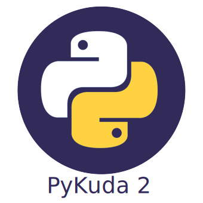

<center>**A developer friendly wrapper for kuda API**</center>
<hr/>
Documentation: []()

Source Code: [https://github.com/jennyosato/pykuda2](https://github.com/jennyosato/pykuda2)
<hr/>
PyKuda2 is a python wrapper over the [Kuda Open API](https://kuda.notion.site/Kuda-Developer-Documentation-d1ddd29b97e441c592323201f7f6b42f).
It aims at being developer friendly and easy to use.


The key features are:

* **Type hints**: All methods provided by PyKuda2 are type annotated, so you can easily infer. This improves the
  development experience.
* **Async support**: PyKuda2 allow you to also make calls to Kuda Open API using async/await which is super great
  for example if your project is in [FastAPI](https://fastapi.tiangolo.com/) where every chance of a performance 
  improvement is adds up.

## Requirements
Python 3.9+

PyKuda2 uses [httpx](https://www.python-httpx.org/) under the hood to make API calls to Kuda.

## Installation
<div id="termynal" data-termynal>
    <span data-ty="input">pip install pykuda2</span>
    <span data-ty="progress"></span>
    <span data-ty>Successfully installed pykuda2</span>
</div>

## Example
```py title="Trying out PyKuda2"
import os
from pykuda2 import Kuda

# Fetch your credentials from your environment path
KUDA_EMAIL_ADDRESS = os.getenv("KUDA_EMAIL_ADDRESS")
KUDA_API_KEY = os.getenv("KUDA_EMAIL_ADDRESS")

# Instantiate the Kuda API wrapper
kuda = Kuda(email=KUDA_EMAIL_ADDRESS, api_key=KUDA_API_KEY)

# Get the admin account balance
response = kuda.accounts.get_admin_account_balance()
print(response)

# Get transaction history
response = kuda.transactions.get_transaction_history(page_size=50, page_number=1)
print(response)
```

## Async Too!
PyKuda2 also lets you use `async/await` out of the box. See what it looks like in a [FastAPI](https://fastapi.tiangolo.com/)
project.
```py title="PyKuda2 in async/await mode 😎"
import os
from pykuda2 import AsyncKuda
from fastapi import FastAPI

# Fetch your credentials from your environment path
KUDA_EMAIL_ADDRESS = os.getenv("KUDA_EMAIL_ADDRESS")
KUDA_API_KEY = os.getenv("KUDA_EMAIL_ADDRESS")

# Instantiate the Kuda API wrapper
kuda = AsyncKuda(email=KUDA_EMAIL_ADDRESS, api_key=KUDA_API_KEY)
app = FastAPI()

@app.get("/banks")
async def get_banks():
  response = await kuda.transactions.get_banks()
  return response.data

```

## License
This project is licensed under the terms of the MIT license.
